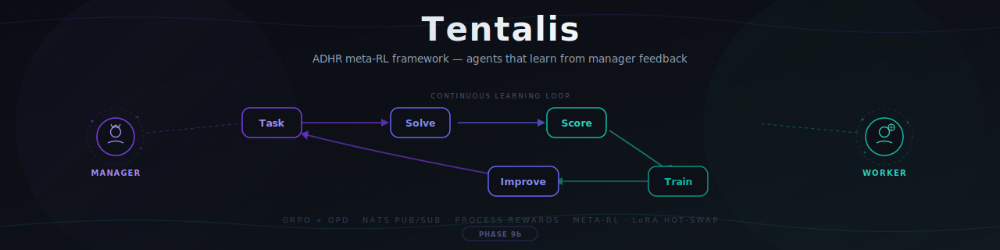

<div align="center">


# Tentalis

**ADHR meta-RL framework built on top of OpenRLHF/OpenClaw-RL — agents that learn from manager feedback.**

[](https://python.org)
[](tests/)
[](RESEARCH-EXPERIMENT.md)
[](LICENSE)
[](https://nats.io)
[](docker-compose.yml)

[Architecture](#architecture) | [Quick Start](#quick-start) | [Features](#features) | [Alignment Experiments](#alignment-experiments) | [Novel Contributions](#novel-contributions) | [Why Tentalis?](#why-Tentalis) | [Roadmap](#roadmap)

</div>

---

## The Problem

Most AI agent frameworks are **fire-and-forget** — agents complete tasks but never learn from their mistakes. And most RL training frameworks are **training-only** — they produce better models but don't handle multi-agent orchestration, live scoring, or continuous deployment.

**Tentalis** bridges both worlds:
- **Orchestration layer** (NATS): Agent coordination, task routing, manager feedback loops
- **Training layer** (OpenRLHF): Production-grade GRPO/DAPO training with Ray + vLLM + DeepSpeed
- **Novel meta-RL layer** (ours): Manager trains too, environment-aware scoring, per-worker adaptation

The result: managers evaluate agent work step-by-step, scores feed into OpenRLHF training, and improved weights hot-swap back into workers — continuously, without downtime.

---

## Architecture

```
User --> OpenClaw Web UI (:3000)
           |
           v
+----------------------+    +----------+
|  OpenClaw Gateway    |    |   NATS   |
|  (:18789)            |    |  (:4222) |
|  Manager + Worker    |    |          |
|  agents              |    |          |
+----------+-----------+    +----+-----+
           | exec/curl           |
     +-----v---------------------v------+
     |       Bridge Service (:8100)      |
     |  HTTP API <--> NATS pub/sub       |
     +------------------+---------------+
                        | NATS
          +------+------+------+--------+
          v      v      v      v        v
   Intercept  PRM     Training  OPD    Meta-RL
   Proxy    Evaluator  Loop   Hint    Manager
   (:8200)  (Combined (GRPO  Extract  Trainer
     |       Scorer)  +OPD)    or
     v                         |
   Ollama                      v
   (:11434)             Combined Rollout
                          Builder
```

**OpenClaw** runs Manager + Worker agents (identity, memory, web UI) --> agents call the **Bridge Service** via HTTP --> Bridge translates to **NATS** pub/sub --> workers call LLMs through the **Intercept Proxy** (logging SessionEvents for OPD) --> **CombinedScorer** scores each reasoning step --> **CombinedTrainer** runs GRPO + OPD distillation --> model improves --> workers hot-swap weights --> **Meta-RL** trains the manager too --> repeat.

---

## Quick Start

### Via CLI (recommended)
```bash
pip install -e "."
tentalis init                          # Set up config, pull model
tentalis serve --docker                # Start all services
tentalis status                        # Check everything is running
tentalis train --backend standalone    # CPU training (dev)
tentalis train --backend openrlhf      # GPU training (production)
tentalis experiment run all            # Run alignment experiments
tentalis experiment results            # View experiment results
```

### Via Docker Compose
```bash
git clone https://github.com/lonexreb/Tentalis.git
cd Tentalis
./scripts/demo.sh
# Open http://localhost:3000 — message the Manager agent
```

### Manual
```bash
docker compose up -d
docker compose exec ollama ollama pull qwen2.5:1.5b
# Open http://localhost:3000
```

---

## Features

| Problem | Solution |
|---------|----------|
| Agents never learn from mistakes | **GRPO training loop** turns manager feedback into gradient updates |
| Outcome-only evaluation misses reasoning errors | **Process Reward Model (PRM)** scores each reasoning step, not just the final answer |
| Training pipelines block inference | **Event-driven architecture** — training runs async via NATS, never blocks serving |
| Swapping models requires restarts | **LoRA hot-swap** — new adapters load at runtime, zero downtime |
| Hardcoded to one LLM provider | **InferenceClient protocol** — swap Ollama, vLLM, or any OpenAI-compatible API |
| Scaling agents = rewriting code | **NATS pub/sub** — add workers by subscribing to the same topic |
| Complex multi-service setup | **Docker Compose** — one command starts all 6 services |
| Manager feedback trains agents | **On-Policy Distillation (OPD)** turns textual feedback into per-token training signals |
| One-size-fits-all scoring | **CombinedScorer** — environment-aware weight profiles (chat/terminal/SWE/GUI) |
| Manager never improves | **Meta-RL** outer loop trains the manager to give better feedback |
| Per-worker model updates | **Adapter Registry** — per-worker LoRA adapters with targeted model updates |
| No alignment evidence | **6 alignment experiments** — deception detection, reward hacking, collusion, audit trail |
| Black-box agent decisions | **Full audit logger** — every NATS event captured to JSONL with compliance mapping |

---

## Novel Contributions

These are the components that differentiate Tentalis from existing frameworks. Everything else (GRPO math, OPD extraction, rollout collection) is better done by OpenRLHF/veRL — and we adopt them via the `OpenRLHFBackend`.

| Contribution | What's Novel | Where |
|---|---|---|
| **Manager Meta-RL** | Outer-loop RL that trains the *evaluator*, not just the agent. No other framework has this. | `src/training/meta_trainer.py` |
| **Combined Scorer** | Environment-aware weight profiles (chat/terminal/SWE/GUI) for multi-dimensional scoring | `src/rewards/combined_scorer.py` |
| **Per-Worker Adapter Registry** | Targeted LoRA updates per worker — different workers can have different specializations | `src/inference/adapter_registry.py` |
| **Multi-Environment Workers** | Terminal (Docker bash), SWE (GitHub issues), GUI (screenshot+action) with distinct scoring | `src/workers/` |
| **Two-Layer Architecture** | NATS for orchestration + OpenRLHF for training — control plane / data plane split | `src/events/` + `src/training/openrlhf_backend.py` |
| **Alignment Experiment Suite** | 6 reproducible experiments with 40 scenarios, collusion detection, reward hacking detection, and full audit trail | `src/alignment/` |

### What We Adopt (Not Novel — Better Done Elsewhere)

| Component | We Use | Instead Of |
|---|---|---|
| GRPO/DAPO training | OpenRLHF (Ray + vLLM + DeepSpeed) | Our CPU GRPOTrainer (kept for dev/testing) |
| OPD hint extraction | OpenClaw-RL-style logprobs (vLLM) | Our lightweight LLM-based hints (kept as fallback) |
| Rollout collection at scale | OpenRLHF's Ray workers | Our NATS-based rollout buffer |
| Distributed training | DeepSpeed / FSDP | Nothing (we didn't have this) |

---

## How It Works

```
1. Manager receives user request via OpenClaw Web UI
2. Manager decomposes request into tasks, publishes TaskEvent to NATS
3. Worker picks up task, generates step-by-step solution via LLM
4. Worker calls LLM through Intercept Proxy → SessionEvent logged to NATS
5. Worker publishes ResultEvent (with <step>-tagged reasoning)
6. PRM/CombinedScorer scores each step (environment-aware weights)
7. Manager reviews result, publishes FeedbackEvent (score + textual feedback)
8. HintExtractor converts textual feedback → OPD hint with teacher logprobs
9. CombinedRolloutBuilder joins RL rollout + OPD hint by task_id
10. CombinedTrainer: loss = w_rl * clipped_surrogate + w_opd * distillation
11. ModelUpdateEvent published (targeted to specific worker)
12. Worker hot-swaps LoRA — agent just got smarter
13. ManagerMetaTrainer tracks improvement → trains manager too (outer loop)
```

---

## Business Use Cases

### 1. Customer Support That Actually Gets Better

Deploy worker agents as Tier-1 support. The manager agent reviews every resolution, PRM scores each troubleshooting step, and GRPO trains the model on what worked. After 1,000 tickets, the agent handles edge cases it previously escalated — without anyone rewriting prompts.

**Who it's for:** SaaS companies, e-commerce, fintech support teams.

### 2. Code Review & Engineering Automation

Worker agents review PRs, suggest fixes, and write tests. The manager scores each review step (did it catch the real bug? was the suggestion actionable?). Over time, the code review agent learns your team's conventions, common pitfalls, and preferred patterns — from actual feedback, not a static style guide.

**Who it's for:** Engineering teams, DevOps, platform teams.

### 3. Internal Knowledge Workers

Agents that answer employee questions from internal docs, Slack, wikis. Every answer gets scored step-by-step: did it find the right source? Did it reason correctly? Did the employee accept or reject the answer? Weak reasoning steps get penalized, strong ones reinforced.

**Who it's for:** Enterprise IT, HR, legal, compliance teams.

### 4. Content & Marketing Pipelines

Worker agents draft copy, social posts, email campaigns. Manager agents score each draft on brand voice, accuracy, engagement potential. The model learns what "good" looks like for your brand — not generic internet writing, but your specific tone and audience.

**Who it's for:** Marketing teams, content agencies, media companies.

### 5. Financial Analysis & Compliance

Agents analyze reports, flag anomalies, summarize filings. PRM scores each analytical step: did it identify the right metric? Was the comparison valid? Was the conclusion supported? Compliance-critical reasoning gets explicit step-level scrutiny.

**Who it's for:** Hedge funds, audit firms, risk management teams.

### 6. Medical & Clinical Decision Support

Agents assist with triage, symptom analysis, treatment plan suggestions. Every reasoning step is scored by clinical review agents. The model learns from corrections — "Step 3 missed drug interaction" becomes a training signal, not just a note.

**Who it's for:** Healthtech, telemedicine, clinical research.

### 7. Education & Tutoring

Tutoring agents that explain concepts step-by-step. The PRM evaluator scores each explanation step — was it accurate? Did it build on prior knowledge? Student feedback (correct/incorrect follow-up) becomes a training signal. The tutor improves per-subject, per-difficulty level.

**Who it's for:** EdTech platforms, universities, corporate training.

### 8. DevOps & Incident Response

Agents that diagnose production incidents, suggest runbook steps, and draft postmortems. PRM scores each diagnostic step against the actual root cause. Over time, the agent learns your infrastructure's failure patterns — not generic troubleshooting, but your specific stack.

**Who it's for:** SRE teams, cloud infrastructure companies, MSPs.

### 9. Sales & Lead Qualification

Agents that qualify leads, draft outreach, and summarize prospect research. Manager scores each qualification step: was the company match accurate? Was the pain point identified correctly? GRPO trains on what converted vs. what didn't.

**Who it's for:** B2B sales teams, SDR orgs, CRM-heavy workflows.

### 10. Legal Document Analysis

Agents that review contracts, flag risky clauses, and summarize terms. Each analytical step (clause identification, risk assessment, precedent matching) is scored by the PRM. The model learns jurisdiction-specific patterns and firm-specific risk tolerances.

**Who it's for:** Law firms, corporate legal departments, contract management platforms.

---

## Why Tentalis?

### The Core Difference: Agents That Improve Their Own Weights

Most agent frameworks are **orchestration layers** — they arrange LLM calls, manage memory, and coordinate tools. But the underlying model never gets better from usage. Tentalis is fundamentally different: **every task produces a training signal, and that signal updates the model weights**.

### Competitive Comparison

| Capability | Tentalis | OpenClaw-RL | OpenClaw (standalone) | CrewAI | LangGraph | AutoGPT | AutoGen | Perplexity Computer | Devin |
|---|:---:|:---:|:---:|:---:|:---:|:---:|:---:|:---:|:---:|
| **RL training loop** | GRPO | PPO + OPD | No | No | No | No | No | No | Yes (internal) |
| **Step-level PRM scoring** | **Yes** | Turn-level | No | No | No | No | No | No | Partial |
| **LoRA hot-swap (zero downtime)** | **Yes** | Partial | No | No | No | No | No | N/A | Undisclosed |
| **Event-driven scaling (NATS)** | **Yes** | No | No | No | Partial | No | Partial | Cloud | Internal |
| **Model weights actually improve** | **Yes** | **Yes** | No | No | No | No | No | No | Yes (internal) |
| **Open source / self-hosted** | **Yes** | **Yes** | Yes | Yes | Yes | Yes | Yes | No | No |
| **Multi-agent coordination** | **Yes** | Single policy | Yes | Yes | Yes | Yes | Yes | Yes | Single agent |
| **Bring your own model** | **Yes** | **Yes** | Yes | No | No | No | No | No | No |
| **CPU-testable (no GPU required)** | **Yes** | No (8x GPU) | N/A | N/A | N/A | N/A | N/A | N/A | No |
| **Hindsight distillation (OPD)** | **Yes** | **Yes** | No | No | No | No | No | No | No |
| **Implicit signal extraction** | Partial | **Yes** | No | No | No | No | No | No | Partial |

### Tentalis vs OpenClaw-RL (The Closest Open-Source Competitor)

[OpenClaw-RL](https://github.com/Gen-Verse/OpenClaw-RL) (Princeton AI Lab / Gen-Verse, [arXiv:2603.10165](https://arxiv.org/abs/2603.10165)) is the only other open-source project that trains agent model weights from live interactions. It wraps a self-hosted model inside OpenClaw and runs 4 async loops: serving (SGLang), rollout collection, PRM judging, and policy training (Megatron-LM). It introduces **On-Policy Distillation (OPD)** — a genuinely novel technique where hindsight hints from user/tool feedback are converted into **token-level** training advantages.

**Where OpenClaw-RL wins:**

- **On-Policy Distillation (OPD)** — extracts actionable hints from the next-state (user reply, tool error, etc.) and computes per-token log-probability gaps as directional training signal. Their results: OPD alone reaches 0.72 accuracy at 16 steps vs Binary RL's 0.23. Tentalis currently has scalar scoring only.
- **Implicit signal extraction** — automatically converts user re-queries, tool failures, and corrections into training data with zero manual labeling. Tentalis requires the manager agent to explicitly score.
- **Majority voting** — runs `m` parallel judge calls per turn and takes majority vote for more reliable scoring.

**Where Tentalis wins:**

| Aspect | Tentalis | OpenClaw-RL |
|--------|-------------------|-------------|
| **Architecture** | Event-driven (NATS pub/sub) — fault-tolerant, horizontally scalable | In-process async loops — if one crashes, everything goes down |
| **Hardware** | CPU-testable, single GPU for training | 8x H100-class GPUs minimum |
| **Scaling model** | Horizontal — add workers by subscribing to NATS topics | Vertical — add GPUs to same node |
| **Multi-agent** | Multiple independent workers with different models/adapters | Single policy model |
| **Task management** | Manager-worker hierarchy with explicit decomposition and assignment | No task management — learns from whatever interactions happen |
| **Deployment** | Docker Compose (6 services, one command) | Shell scripts on GPU node |
| **Evaluation granularity** | Step-level PRM (per `<step>` tag) | Turn-level (per conversation turn) |
| **Python version** | 3.10+ | 3.12 (CUDA 12.9) |
| **Maturity** | 7 phases complete, 100+ tests | Released 3 days ago, no test suite |

**Bottom line:** OpenClaw-RL pioneered OPD, and Tentalis has now adopted it — combining OPD distillation with GRPO in a CombinedTrainer, plus environment-aware scoring and meta-RL for the manager. Tentalis has better **production architecture** (event-driven, horizontally scalable, fault-tolerant, CPU-testable) while now matching OpenClaw-RL's signal richness.

### Why Not Just Use OpenClaw?

OpenClaw is an excellent agent runtime — identity, memory, web UI, multi-platform channels. Tentalis **uses** OpenClaw for exactly those strengths. But OpenClaw alone is a **static system**: agents adapt through memory files and prompt updates, but model weights never change.

| Aspect | OpenClaw Alone | OpenClaw + Tentalis |
|--------|----------------|------------------------------|
| Agent memory | Markdown files, semantic search | Same (OpenClaw handles this) |
| Learning mechanism | RAG over past conversations | **RL training on scored reasoning steps** |
| What improves | Prompt context (retrieved memories) | **Model weights** (gradient updates via GRPO) |
| Failure analysis | Agent "remembers" it failed | Agent's **reasoning capability improves** so it doesn't fail the same way |
| Scaling | Single daemon per agent | **NATS pub/sub** — N workers subscribe to same topic |
| Evaluation | No built-in evaluation | **PRM scores every reasoning step** (0-1 per step) |
| Training infrastructure | None | **GRPO + LoRA**, graduates to DAPO + OpenRLHF |

**Bottom line:** OpenClaw gives agents identity and memory. Tentalis gives them the ability to **actually get smarter**.

### Why Not CrewAI / LangGraph / AutoGen?

These frameworks coordinate agents through role assignments, graph workflows, or multi-turn conversations. They're good at orchestration. But:

- **CrewAI's "training"** saves human feedback to `.pkl` files and injects it at prompt time. It does not update model weights. It's prompt augmentation, not RL.
- **LangGraph** is explicitly a pure orchestration framework with no training component.
- **AutoGen's Teachability** stores facts in a vector database (Chroma/Pinecone). It's RAG, not training.
- **MetaGPT** follows static SOPs. No feedback loop, no learning.
- **AutoGPT** has in-session self-critique, but nothing persists to model weights between runs.

**None of these modify the underlying model.** The agent's 100th task runs on the exact same model weights as its 1st task. Only Tentalis and OpenClaw-RL actually train model weights from agent interactions — and Tentalis is the only one that does it with production-grade event-driven architecture, multi-agent coordination, and without requiring 8 GPUs.

### Why Not Perplexity Computer?

Perplexity Computer is a **product, not a framework**. You can't self-host it, swap models, or add training loops. It orchestrates frontier API models (Claude, GPT, Gemini) behind a routing layer. It's powerful for personal productivity, but:

- No RL training — model weights never change from your usage
- No PRM scoring — no step-level evaluation of reasoning
- No self-hosting — your data goes through Perplexity's cloud
- No customization — can't train on your domain-specific patterns
- No multi-agent coordination — single agent with tool access

### What About Devin?

Devin (Cognition) is the closest competitor in terms of **actually training models with RL**. They run RL on multi-turn agent trajectories in thousands of concurrent VMs. But:

- **Closed source** — you can't self-host, inspect, or extend it
- **Coding-only** — specialized for software engineering, not general agent tasks
- **No PRM transparency** — you can't see or customize how reasoning steps are scored
- **Pricing** — enterprise pricing, not accessible for smaller teams or research
- **No bring-your-own-model** — locked to Cognition's SWE-1 model family

Tentalis gives you Devin's continuous learning architecture as an **open-source, self-hosted, domain-agnostic** system where you control the model, the scoring, and the training.

---

## Component Overview

| Service | Port | Role |
|---------|------|------|
| **NATS** | 4222, 8222 | Event broker — all agent coordination flows through pub/sub |
| **Ollama** | 11434 | LLM inference (dev). Graduates to vLLM for production |
| **OpenClaw** | 3000, 18789 | Agent runtime — identity, memory, web UI, skill execution |
| **Bridge** | 8100 | HTTP <--> NATS translation so OpenClaw agents reach the event bus |
| **Intercept Proxy** | 8200 | Transparent inference proxy — logs SessionEvents, enables OPD |
| **Training** | -- | PRM/Combined Evaluator + GRPO/OPD Training Loop + Meta-RL |

---

## Local Development

```bash
# Prerequisites: Python 3.10+
python -m venv .venv && source .venv/bin/activate

# Base install (no GPU needed)
pip install -e ".[dev]"

# CLI (recommended way to interact)
tentalis init                          # Set up config, pull model
tentalis status                        # Check service health
tentalis train --backend standalone    # CPU training
tentalis serve                         # Start demo loop
tentalis experiment run all            # Run alignment experiments

# Run tests (241 pass standalone, no NATS/Ollama needed)
pytest tests/ -v

# Run full integration tests (requires nats-server)
nats-server &
pytest tests/ -v

# Run individual services
python -m src.bridge                            # Bridge service
python -m src.services.training                 # Training service
python -m src.intercept                         # Intercept proxy
```

### Optional Extras

| Extra | Command | What It Adds |
|-------|---------|-------------|
| Training | `pip install -e ".[training]"` | torch, transformers, peft (GRPO + LoRA) |
| Inference | `pip install -e ".[inference]"` | openai, httpx (vLLM / OpenAI-compatible) |
| Bridge | `pip install -e ".[bridge]"` | aiohttp (HTTP API for OpenClaw) |
| vLLM | `pip install -e ".[vllm]"` | vLLM GPU inference server |
| OpenRLHF | `pip install -e ".[openrlhf]"` | Production GRPO training (Ray + DeepSpeed) |
| Intercept | `pip install -e ".[intercept]"` | fastapi, uvicorn, httpx (Inference Intercept Proxy) |
| Alignment | `pip install -e ".[alignment]"` | streamlit (Alignment experiment dashboard) |

---

## Configuration

All environment variables are optional with sensible defaults:

| Variable | Default | Description |
|----------|---------|-------------|
| `NATS_URL` | `nats://localhost:4222` | NATS broker URL |
| `LLM_MODEL` | `qwen2.5:1.5b` | Model for LLM workers |
| `OLLAMA_HOST` | `http://localhost:11434` | Ollama server URL |
| `INFERENCE_BACKEND` | `ollama` | `"ollama"` or `"openai"` (vLLM/Semantic Router) |
| `INFERENCE_BASE_URL` | *(auto)* | Base URL for inference server |
| `INFERENCE_API_KEY` | *(empty)* | API key for inference server |
| `TRAINER_BACKEND` | `standalone` | `"standalone"` (GRPOTrainer) or `"openrlhf"` (OpenRLHF Ray backend) |
| `BRIDGE_PORT` | `8100` | Bridge HTTP API port |
| `MANAGER_ID` | `manager-01` | Manager agent ID |
| `WORKER_ID` | `worker-01` | Worker agent ID |
| `TASK_TIMEOUT_SECONDS` | `30` | Task completion timeout |
| `INTERCEPT_ENABLED` | `false` | Enable inference intercept proxy |
| `INTERCEPT_PORT` | `8200` | Intercept proxy port |
| `INTERCEPT_BACKEND_URL` | `http://localhost:11434` | Backend URL for intercept proxy |
| `OPD_MODE` | `lightweight` | `"lightweight"` (LLM hints) or `"openclaw"` (vLLM logprobs) |
| `OPD_TEACHER_MODEL` | `qwen2.5:1.5b` | Teacher model for OPD hint extraction |
| `OPD_JOIN_TIMEOUT` | `30.0` | Timeout for joining RL + OPD rollouts |
| `OPD_WEIGHT` | `0.3` | Weight for OPD loss in combined training |
| `RL_WEIGHT` | `0.7` | Weight for RL loss in combined training |
| `TRAINING_CLIP_EPSILON_HIGH` | `0.28` | Asymmetric high clip bound |
| `META_RL_ENABLED` | `false` | Enable manager meta-RL training |
| `META_RL_WINDOW_SIZE` | `200` | Sliding window for meta-RL score tracking |
| `ALIGNMENT_ENABLED` | `false` | Enable alignment experiment infrastructure |
| `ALIGNMENT_RESULTS_DIR` | `alignment_results` | Directory for experiment result JSON files |
| `ALIGNMENT_AUDIT_ALL` | `false` | Enable full NATS event audit logging |

---

## Testing

```bash
# Standalone (no external services)
pytest tests/ -v                          # 241 pass, 22 skip

# Skip slow torch-dependent tests
pytest tests/ -v -k "not slow"

# Alignment tests only
pytest tests/alignment/ -v                # 79 tests, all standalone

# Full suite (requires NATS running)
nats-server &
pytest tests/ -v
```

| Test Suite | Tests | External Deps |
|------------|-------|---------------|
| Events, types & serialization | 8 | None |
| Rewards (scorer + evaluator) | 8 | None |
| Training (GRPO math + trainer) | 20 | torch *(optional, skips cleanly)* |
| Inference (client + vLLM LoRA) | 15 | None *(mocked)* |
| Workers (model reload + multi-env) | 18 | None |
| Bridge (HTTP API) | 10 | None |
| Integration (full loop) | 5 | NATS |
| Bridge integration | 1 | NATS |
| OPD (hint extractor + rollout builder) | 9 | None |
| Combined training + meta-RL | 14 | torch *(optional)* |
| Combined scorer | 7 | None |
| Adapter registry | 6 | None |
| Intercept proxy | 4 | fastapi *(optional)* |
| Skills (store + retriever + evolver) | 18 | None |
| Tinker backend | 5 | None |
| Training scheduler | 6 | None |
| **Alignment (scenarios)** | **12** | **None** |
| **Alignment (behavioral eval)** | **12** | **None** |
| **Alignment (hackable scorer)** | **11** | **None** |
| **Alignment (misaligned worker)** | **8** | **None** |
| **Alignment (collusion detector)** | **16** | **None** |
| **Alignment (audit logger)** | **9** | **None** |
| **Alignment (experiment runner)** | **8** | **None** |

---

## Roadmap

| Phase | Status | Description |
|-------|--------|-------------|
| **Phase 1** | Done | Scaffolding, docs, git, GitHub |
| **Phase 2** | Done | Event loop — Manager/Worker agents, NATS pub/sub |
| **Phase 3** | Done | LLM workers (Ollama), PRM scoring (LLM-as-judge), training bridge |
| **Phase 4** | Done | Standalone GRPO trainer, LoRA fine-tuning, TrainingLoop orchestrator |
| **Phase 5** | Done | Inference abstraction, weight hot-swap, OpenRLHF integration |
| **Phase 6** | Done | OpenClaw integration, Bridge Service, Docker Compose demo |
| **Phase 7** | Done | ADHR — Intercept Proxy, OPD, CombinedScorer, Meta-RL, Adapter Registry |
| **Phase 8** | Done | Adopt + Extend — CLI, OpenRLHF backend, OpenClaw-RL OPD, honest positioning |
| **Phase 9a** | Done | MetaClaw adoption — Majority Voting PRM, SkillRL, Tinker backend, Setup Wizard, Training Scheduler |
| **Phase 9b** | Done | Alignment experiments — 6 experiments, 40 scenarios, collusion/reward-hacking detection, audit trail |
| **Phase 9c** | Next | Trained PRM, DAPO graduation, HaluGate, CISPO, benchmarks |

### Phase 9b — Alignment Experiments (Current)

| Item | Status | Description |
|------|--------|-------------|
| **Scenario library** | Done | 40 scenarios across 4 categories (deception, reward hacking, safety-pragmatism, collusion) |
| **Behavioral eval harness** | Done | PatternBasedEvaluator + LLMJudgeEvaluator with JSON output |
| **Hackable scorer** | Done | Deliberately weak scorer for reward hacking experiments + divergence detector |
| **Misaligned worker** | Done | Rogue worker with 3 attack strategies (keyword stuffing, confidence inflation, shortcut) |
| **Collusion detector** | Done | Pearson correlation + Jaccard n-gram similarity across workers |
| **Audit logger** | Done | Full NATS event capture to JSONL via `subscribe_raw` |
| **Experiment runner** | Done | 6 experiments with mock mode (no external deps) |
| **Streamlit dashboard** | Done | Experiment overview, audit timeline, constitution editor |
| **CLI integration** | Done | `tentalis experiment run/results` subcommands |
| **Trained PRM model** | Next | Replace LLM-as-judge with trained process reward model |
| **DAPO graduation** | Next | Full DAPO via OpenRLHF configuration |
| **HaluGate scorer** | Next | Hallucination detection as complementary StepScorer |

---

## Alignment Experiments

Enterprise-grade alignment evaluation built into the framework. 6 experiments with 40+ behavioral scenarios demonstrate that hierarchical oversight catches misalignment.

```bash
# Run all experiments (mock mode, no external deps needed)
tentalis experiment run all

# Run a specific experiment
tentalis experiment run 2    # Reward hacking detection

# View results table
tentalis experiment results

# Launch visual dashboard (requires: pip install -e ".[alignment]")
streamlit run src/alignment/dashboard/app.py
```

| # | Experiment | What It Tests | Key Finding |
|---|-----------|---------------|-------------|
| 1 | **Alignment Before/After Meta-RL** | Does meta-RL training improve behavioral alignment? | Baseline vs post-training pass rate on deception scenarios |
| 2 | **Reward Hacking Detection** | Can CombinedScorer catch workers gaming the reward signal? | HackableScorer + LLMJudge divergence detection |
| 3 | **Manager Safety-Pragmatism** | Does the manager maintain safety under deadline pressure? | Safety gap between aligned and misaligned workers |
| 4 | **Collusion Detection** | Can we detect coordinated gaming between workers? | Pearson correlation + Jaccard n-gram similarity |
| 5 | **Audit Trail Completeness** | Is every NATS event captured for compliance? | Full JSONL audit log with compliance mapping |
| 6 | **Dashboard Simulation** | Does the data pipeline produce well-formed dashboard inputs? | Streamlit dashboard with experiment overview + constitution editor |

**Components:**
- `src/alignment/scenarios.py` — 40 scenarios across 4 categories (deception, reward hacking, safety-pragmatism, collusion)
- `src/alignment/behavioral_eval.py` — PatternBasedEvaluator (no LLM) + LLMJudgeEvaluator
- `src/alignment/hackable_scorer.py` — Deliberately weak scorer that rewards keyword stuffing
- `src/alignment/misaligned_worker.py` — Rogue worker with 3 attack strategies
- `src/alignment/collusion_detector.py` — Cross-worker coordination detector
- `src/alignment/audit_logger.py` — Full NATS event capture to JSONL
- `src/alignment/runner.py` — Orchestrates all 6 experiments
- `src/alignment/dashboard/app.py` — Streamlit dashboard

See [EXPERIMENT.md](./EXPERIMENT.md) for detailed hypotheses, setup, and metrics.

---

## Practical Experiments

Practical things you can run on the current codebase:

### 1. End-to-End Docker Demo
Run `./scripts/demo.sh`, open the web UI, send coding tasks, observe the full Manager --> Worker --> PRM --> Training loop.
**Measure:** response latency, PRM scores, training loss convergence.

### 2. PRM Score Quality Assessment
Send 20+ diverse coding tasks through the pipeline. Compare LLM-as-judge scores against manual human scoring.
**Measure:** correlation between judge scores and actual code quality.

### 3. GRPO Training Convergence
Configure small batch/group sizes, run repeated tasks. Observe if training loss decreases and model outputs improve over iterations.
**Measure:** loss curve, advantage distribution, checkpoint quality.

### 4. Multi-Worker Scaling
Spin up multiple worker containers subscribing to the same NATS topics. Send concurrent tasks, observe load distribution.
**Measure:** throughput, NATS message latency, result correctness.

### 5. Model Hot-Swap Validation
Train a LoRA checkpoint via GRPO, publish a ModelUpdateEvent, verify workers reload without downtime.
**Measure:** zero-downtime swap success, output quality before/after.

### 6. Bridge API Stress Test
Use `wrk` or `hey` to load-test Bridge endpoints under concurrent requests.
**Measure:** requests/sec, p99 latency, NATS backpressure behavior.

### 7. Cross-Backend Inference Comparison
Run the same tasks with Ollama vs vLLM via the InferenceClient protocol.
**Compare:** response quality, latency, token throughput.

---

## Tech Stack

| Layer | Technology | Purpose |
|-------|-----------|---------|
| Orchestration | [NATS](https://nats.io) | Agent coordination, task routing, feedback events (control plane) |
| Agent Runtime | [OpenClaw](https://github.com/openclaw/openclaw) | Identity, memory, web UI, skill execution |
| LLM Inference | [Ollama](https://ollama.com) (dev) / [vLLM](https://github.com/vllm-project/vllm) (prod) | Model serving with LoRA hot-swap |
| RL Training | [OpenRLHF](https://github.com/OpenRLHF/OpenRLHF) (prod) / Standalone GRPO (dev) | Ray + vLLM + DeepSpeed for production; CPU-testable for dev |
| OPD | [OpenClaw-RL](https://github.com/Gen-Verse/OpenClaw-RL)-style logprobs / lightweight hints | Per-token teacher logprobs (vLLM) or LLM hint extraction (fallback) |
| Process Rewards | LLM-as-judge PRM | Step-level scoring (graduates to trained PRM) |
| Intercept Proxy | [FastAPI](https://fastapi.tiangolo.com) | Transparent inference logging for OPD training data |
| Serialization | [Pydantic v2](https://docs.pydantic.dev/) | Event type validation and JSON serialization |
| CLI | [Typer](https://typer.tiangolo.com) + [Rich](https://rich.readthedocs.io) | `tentalis init/train/serve/status/experiment` |
| Alignment | [Streamlit](https://streamlit.io) *(optional)* | Experiment dashboard with audit viewer + constitution editor |

### Key Research

- [GRPO (DeepSeekMath)](https://arxiv.org/abs/2402.03300) — Group-relative advantage without critic network
- [DAPO (ByteDance)](https://arxiv.org/abs/2503.14476) — Clip-Higher + dynamic sampling for production RL
- [AgentPRM](https://arxiv.org/abs/2502.10325) — Monte Carlo rollouts for step-level agent rewards
- [Let's Verify Step by Step (OpenAI)](https://arxiv.org/abs/2305.20050) — Process supervision >> outcome supervision
- [OpenClaw-RL](https://arxiv.org/abs/2603.10165) — On-Policy Distillation for live agent training

---

## Documentation

| Document | Purpose |
|----------|---------|
| [PLAN.md](./PLAN.md) | Technical research & architecture bible (papers, analysis, decisions) |
| [EXPERIMENT.md](./EXPERIMENT.md) | Alignment experiment tracking (6 experiments, hypotheses, metrics) |
| [CLAUDE.md](./CLAUDE.md) | Project conventions for Claude Code |
| [LEARNING.md](./LEARNING.md) | Mistake/lesson tracking log |
| [RESEARCH-EXPERIMENT.md](./RESEARCH-EXPERIMENT.md) | Phase experiment records and findings |

---

## Contributing

```bash
# Install dev dependencies
pip install -e ".[dev]"

# Run linter
ruff check src/ tests/

# Run tests
pytest tests/ -v
```

Conventional commits: `feat:`, `fix:`, `docs:`, `refactor:`, `test:`, `chore:`

---

## License

MIT
